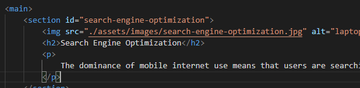

# Horiseon-seo-accessibility-code-refactor

## Description

This project required the refactoring of existing code to improve accessibility, which would in turn improve the search engine optimisation of the landing page.

The user story was:

```
AS A marketing agency
I WANT a codebase that follows accessibility standards
SO THAT our own site is optimised for search engines
```

Using the HTML, CSS and images provided, the acceptance criteria required us to adjust the HTML to have semantic HTML elements, ensure the elements follows a logical structure independent of the styling and positioning, use alt attributes for all images, ensure the heading attributes fell in sequential order, and make the title clear and concise.

It was also encouraged to use the Scout Rule, which is to leave the code a little cleaner than when first provided. Since we were tasked to update the HTML to use semantic HTML elements, there was an opportunity here to clean up and consolidate the HTML and CSS to relate to element selectors rather than using multiple classes.

> The final project can be found at: https://chardige.github.io/Horiseon-seo-accessibility-code-refactor/

>The final HTML and CSS can be found at: https://github.com/CharDige/Horiseon-seo-accessibility-code-refactor


## The process - how I broke down the problem

After creating the GitHub repository and pushing through my initial commit of the HTML and CSS, I broke down the Acceptance Criteria into smaller, bite-sized pieces.

The first easy win was updating the title of the landing page to be clear and concise. I went with "Horiseon: SEO, online reputation management and social media marketing" as it provided the company name and the three key areas they specialise in. I then committed this change.


Next, I wanted to break up the HTML visually for me into relevant sections, so it would be clear to me what each part of the HTML related to. I identified through Google Dev Tools each div class and how they interacted on the landing page, and then inserted breaks into the HTML.


I then reviewed the multiple div classes and identified which ones matched with certain semantic HTML elements, such as "Header" and "Footer". I updated the HTML by replacing the divs with these semantic HTML elements (as well as other semantic HTML elements I thought of), then commited these changes. This also supported in the beginning of creating a logical structure independent of styling and positioning.


I knew that changing the HTML in this way would impact the CSS when the classes were being removed, so I made sure to take note of the classes I was replacing so I could easily go back into the CSS and make adjustments where needed. Once I had made these changes in the CSS, the styling on the page went back to normal.


I then added the alt attributes to each img, commiting these changes. Then, I reviewed the heading attributes, deciding the make each section in the Aside HTML element a h2 heading (as this would make more sense for screen readers) and replaced the h2 heading in the footer by styling the paragraph element instead. I did this as this did not suit a heading element for accessibility. I then committed these changes to the HTML.


After I'd finished updating the HTML for accessibility, I turned my attention to commenting on the CSS. I provided the initial comments, committing this in the first instance. Then, I spent time consolidating where there were repeated styles within multiple classes. By adjusting the HTML to have semantic HTML elements, a lot of classes weren't needed any more as Element Selectors could be used instead. I continued to test these changes in the browser, then committed my final consolidated CSS.


This then provided an opportunity to clean up the HTML by removing the classes in the code. Then, I fixed up the broken link in the navigation menu by including a "search-engine-optimization" id in the relevant section.



## Final


This can also be viewed at this link: https://chardige.github.io/Horiseon-seo-accessibility-code-refactor/

And, the HTML and CSS can be viewed in the GitHub repository: https://github.com/CharDige/Horiseon-seo-accessibility-code-refactor

## Challenges

One of the biggest challenges for me was changing the Hero image to be a figure, as this caused the image to stretch even though I didn't change the CSS. By using Google and W3 Schools, I found a solution using the "object-fit: cover;" CSS property. My original solution for this was to change the height to "auto". However, this caused the length of the page to increase.

Finding this solution by entering the problem into Google and doing a bit of research on W3 Schools helped ensure a responsive and accessible page.

## What I learnt

I learnt a lot about how semantic HTML not only helps with navigating through the code, but also supports the browser in displaying the information in a certain way. For example, using the 'Aside' semantic HTML element supported in creating the section of the website that sits to the side of the main content.

I also learnt a lot about how consolidating code reduced the complexity of the code. This meant I could read through the HTML and CSS without getting lost in many lines of complicated code. Semantic HTML also supported cleaning up CSS, since it was easier to bring together repeated classes into element selectors.


## Credits

Referring to W3 Schools for the "object-fit: cover;" CSS property really helped, so I have provided a reference to the page below.

W3 Schools (2022), *CSS The object-fit Property*, W3 School, https://www.w3schools.com/css/css3_object-fit.asp


## License

Public Domain.